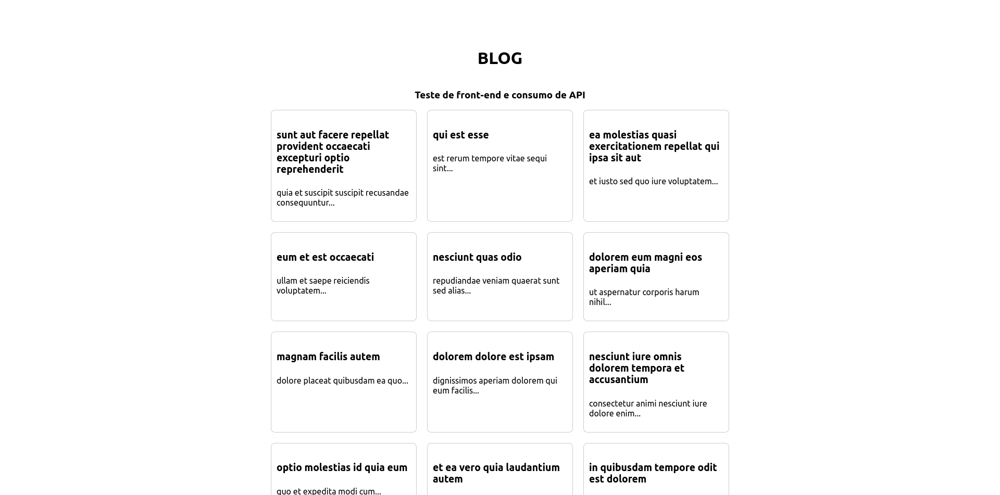
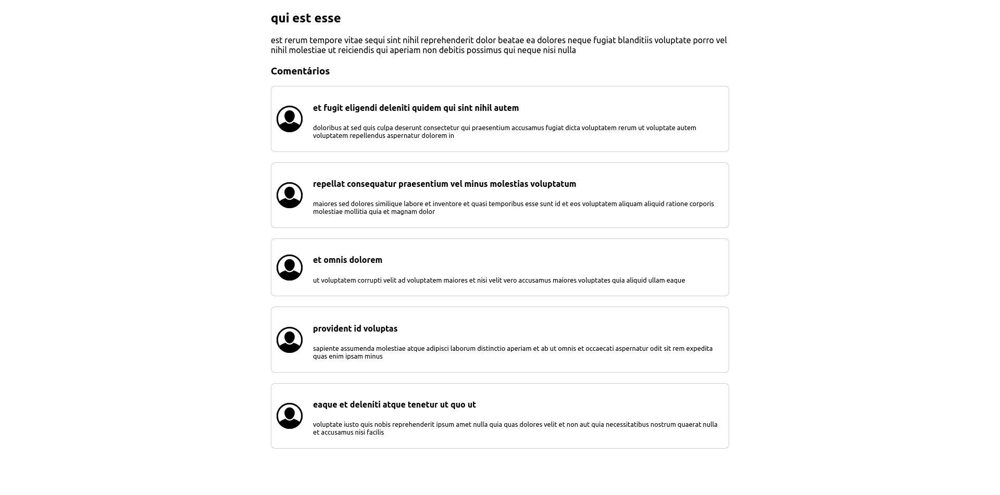
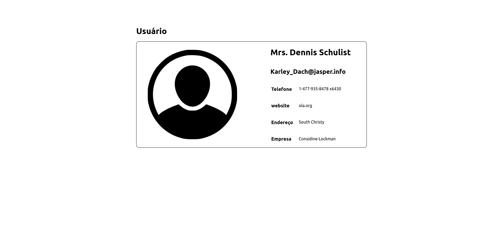

# Spread-Your-Wings

# resolução do teste de front end

## Tecnologias


Como tecnologias base foi utilizado o NextJs e consequentemente o ReactJs. O Next é um framework contruido sobre o React, então possuí diversas funcionalidades facilitadoras do desenvolvimento, além de ser extremamente rápido.


Para trabalhar com a API fornecida, foi utilizado o TypeScript, porque com ele é possivel definir contratos e interfaces que asseguram a coesão do código. Evitando quebras por má definição de tipos por parte do javascript.


O Sass é um grande facilitador da estilização. Foi muito útil para da definição dos estilos locais de cada componente e organização do código. O resultado é um trabalho bem menos verboso do que o CSS puro.

### ⚠️Instruções para execução do front-end
 
##### 1. Clone este repositório 
  
##### 2. Acesse esta pasta pelo terminal 
```bash  
cd spread-your-wings
```

##### 3. instale as dependencias com npm 
> Utilize a versão LTS do Node 
```bash 
 npm install 
```
##### 4. Execute com o script do npm
```bash 
 npm run dev 
``` 
  
##### 5. Acesse a aplicação pelo navegador 
```bash 
localhost:3000 
```
 
### Capturas de Tela da aplicação final 

#### Página inicial


#### Leitura de post e comentários


#### Perfil de usuário
